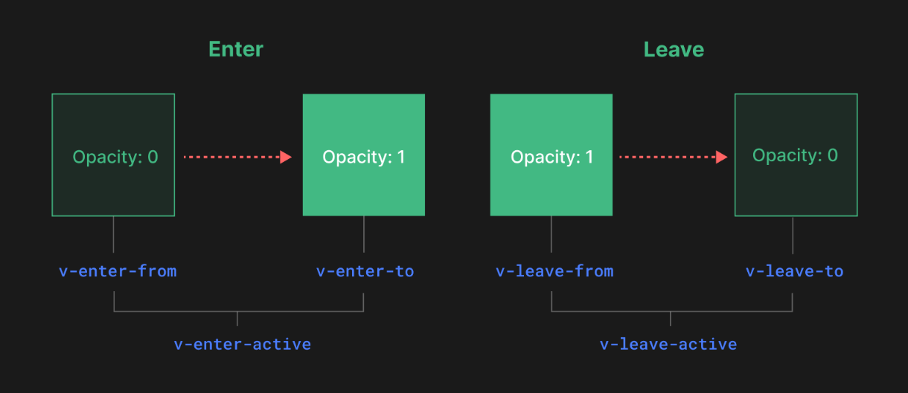

- <\Transition> serve para aplicar animações quando um componente está saindo ou entrando do DOM
- Quando esse componente está em volta de um elemento e ele for rodado, ele vai ver se existe transition ou animation css dentro desse elemento, se tiver, ele vai ser acionado e vai adicionar ou remover certinho

- o transition pode receber o atributo name
- se ele tiver o atributo name, os atributos de classe css terão que ser name-leave-from instead of v-leave-from
- Vou pular essa parte pois não sei css animation yet