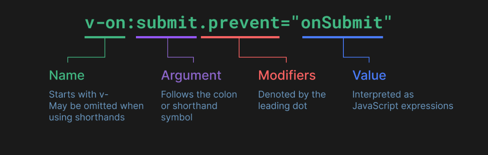

# Sintaxe
- Mustache syntax
    - \{\{ \}\}
    - Os dados vão dentro desass double curly brackets 
- v-bind
    - A sintaxe mustache não funciona em HTML, então devemos usar o v-bind
    - syntax
        - v-bind:['atribute']='value'
    - shorthand
        - :['atribute']='value'
    - Em valores booleanos
        - Se o atributo tiver o mesmo valor do valor, pode colocar apenas o atributo
    - atributos podem ser um objeto com diversos atributos dentro
        - atribbutes = {id:"bigger",class:"red"}
    - o v-bind permite expressões JS dentro dela
- Directives
    - São atributos especiais do vue
    - Lembre de passar single JS expressions
    